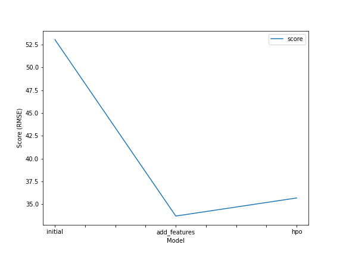
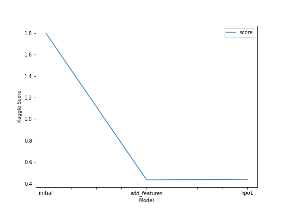

# Report: Predict Bike Sharing Demand with AutoGluon Solution
#### SEYIFUNMI M. OWOEYE

## Initial Training
### What did you realize when you tried to submit your predictions? What changes were needed to the output of the predictor to submit your results?
TODO: Kaggle rejected predictions with negative values. To fix this issue, I had to set all negative predictions to zero.

### What was the top ranked model that performed?
TODO: Add your explanation
WeightedEnsemble_L3 was the best model, followed by WeightedEnsemble_L2 after feature engineering

## Exploratory data analysis and feature creation
### What did the exploratory analysis find and how did you add additional features?
TODO: Add your explanation
After preprocessing the dataset, I ensured that each variable had the correct data type. Additionally, I generated four new features (day, month, year, day_of_week and hour) from the datetime variable. Since these new features represent ordinal data, I assigned them the appropriate data type. I also created a new column called `temp_category` that assigns the categories "Hot", "Mild", or "Cold" based on the temperature values in the `temp` column. Temperatures greater than or equal to 25 are categorized as "Hot", temperatures less than or equal to 10 are categorized as "Cold", and temperatures between 10 and 25 are categorized as "Mild". This allows for easy identification and analysis of temperature ranges in the dataset.

Next, I examined the distribution of the numeric features (`Temp`, `atemp`, `casual`, `registered`, `windspeed`, and `count`). I found that none of the variables followed a normal distribution. Specifically, `temp` exhibited a bimodal distribution, while `atemp` displayed a multimodal distribution. As expected, both registered and casual had extremely right-skewed distributions, similar to the distribution of count. This makes sense since the sum of registered and casual corresponds to the total count of bike rentals.

In addition to assessing the distribution of the numeric features, I analyzed the overall patterns and trends in the categorical features using bar charts. While these visualizations provided some insights, they weren't particularly informative. However, I did observe that bike rentals were higher on workdays compared to non-workdays, and there was an increase in rentals during clear `weather` conditions. To extract more meaningful information from the categorical features, I explored their trends grouped by year. The results indicated that bike rentals increased in 2012 compared to 2011, suggesting a growing acceptance of bikes as a means of transportation. Although bike rentals were higher on workdays in the overall dataset, the analysis based on `year` revealed no significant increase in rentals on workdays versus non-workdays (weekends and holidays) in either year. Regarding `weather` and `season`, it was evident that people tend to use bikes more during warmer periods of the year. Analyzing the trends by `hour` revealed that bike usage peaked between 7 AM and 8 PM, with the highest demand occurring around 8 AM and from 4 PM to 7 PM throughout the year.

Furthermore, I discovered a strong positive correlation of approximately 0.98 between `temp` and `atemp`, suggesting a high degree of association (multicollinearity) between these two features. Consequently, it may be appropriate to drop one of them, and in this case, I recommend dropping atemp. Additionally, count exhibited highly positive correlations of approximately 0.97 and 0.68 with `registered` and `casual`, respectively. This correlation is expected since the sum of `registered` and `casual` yields the total count of bike rentals.

Lastly, I noted a moderate positive correlation of approximately 0.39 between `temp` and `count`, indicating that higher temperatures tend to be associated with higher bike rental counts. As the variables casual and registered are not included in the test dataset, it is advisable to drop them from the analysis.

### How much better did your model preform after adding additional features and why do you think that is?

The model's performance significantly improved after adding the additional features. The reduction in RMSE from 53.039754 to about 33.707630 and the decrease in the Kaggle score from approximately 1.8001 to 0.43413 indicate a substantial improvement in the model's predictive accuracy. The new features, such as day, month, year, and hour, and temp_category provided the model with more detailed information about the dataset. Also, removing one of the highly correlated features and using the correct data type helped reduced redundancy, allowing the model to focus on the most relevant and independent information, and to better capture the underlying patterns in within the dataset.

## Hyper parameter tuning
### How much better did your model preform after trying different hyper parameters?

I was unable to improve the performance of the model after trying different hyper parameters. Rather I obtained models slightly lower in performance (0.43413 and 0.44260 as Kaggle Score) to the previous model.

### If you were given more time with this dataset, where do you think you would spend more time?

Given additional time, I would prioritize enhancing the hyperparameter tuning process by exploring different combinations of hyperparameters to find the ones that yield the best results for improved model performance.

### Create a table with the models you ran, the hyperparameters modified, and the kaggle score.

|     Model     |     Hyperparameters  used for tuning                            |
|:-------------:|:---------------------------------------------------------------:|
|   NN_TORCH    | num_epochs=10, learning_rate=5e-4, dropout_prob=0.3             |
|      GBM      | num_boost_round=100, num_leaves=36                              |
|      CAT      | learning_rate=5e-4, l2_leaf_reg=3, depth=[4, 10], subsample=1.0 |
|      XGB      | eta=0.1, max_depth=3, subsample=1.0                             |
|    FASTAI     | learning_rate=5e-4, pretrained=[True, False]                    |
|      RF       | N/A                                                             |
|      XT       | N/A                                                             |
|      KNN      | N/A                                                             |

|     Model      | time_limit |                      Hyperparameters                             |  score |
|:--------------:|:----------:|:----------------------------------------------------------------:|:------:|
|   initial      |    600     |                             auto                                 | 1.8001 |
| add_features   |    600     |                             auto                                 | 0.43413|
| hpo1 - NN_TORCH|    900     |  num_epochs=10, learning_rate=5e-4, dropout_prob=0.3             | 0.43957|
| hpo1 - GBM     |    900     |  num_boost_round=100, num_leaves=36                              | 0.43957|
| hpo1 - CAT     |    900     |  learning_rate=5e-4, l2_leaf_reg=3, depth=[4, 10], subsample=1.0 | 0.43957|
| hpo1 - XGB     |    900     |  eta=0.1, max_depth=3, subsample=1.0                             | 0.43957|
| hpo1 - FASTAI  |    900     |  learning_rate=5e-4, pretrained=[True, False]                    | 0.43957|
| hpo1 - RF      |    900     |                             not specified                        | 0.43957|
| hpo1 - XT      |    900     |                             not specified                        | 0.43957|
| hpo1 - KNN     |    900     |                             not specified                        | 0.43957|

### Create a line plot showing the top model score for the three (or more) training runs during the project.

TODO: Replace the image below with your own.

**_NOTE_**: The RMSE's reported and plotted in the image below do not contain the negative signs included by AutoGluon

### Create a line plot showing the top kaggle score for the three (or more) prediction submissions during the project.

TODO: Replace the image below with your own.

## Summary
In summary, the dataset was preprocessed by ensuring correct data types for variables and generating new features. The distribution analysis revealed non-normal distributions for numeric features, with bimodal and multimodal patterns observed. Categorical features were explored using bar charts, showing higher bike rentals on workdays and during clear weather conditions. Trends by year indicated an increase in bike rentals from 2011 to 2012. Hourly analysis revealed peak bike usage between 7 AM and 8 PM, with the highest demand in the morning and late afternoon. Strong positive correlations were found between temp and atemp, as well as between count and registered/casual. A moderate positive correlation was observed between temp and count. Removing redundant features and adding new features improved the model's performance, leading to reduced RMSE and improved Kaggle score.
